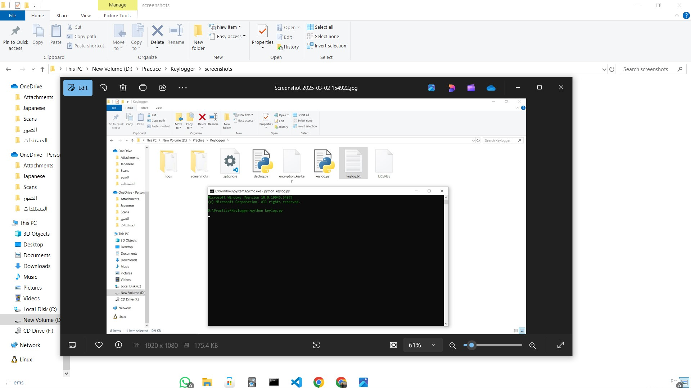

# 🔹 Advanced Keylogger (For Ethical Use Only)

⚠ Warning: This tool is for educational and ethical research purposes only. Do not use it for malicious activities.

## 📌 Features

✔ Captures keystrokes and saves them to an encrypted log file.

✔ Takes automatic screenshots every 60 seconds.

✔ Encrypts logs using Fernet encryption for security.

✔ Runs silently in the background.

✔ Can be stopped using a simple stop.txt file.


---

## 🔧 Installation & Setup

1️⃣ Install Dependencies

First, install the required Python libraries:
```
pip install pynput cryptography pillow mss pyinstaller
```
2️⃣ Run the Keylogger

Run the script manually using:
```
python keylogger.py
```
3️⃣ Stop the Keylogger

To stop the keylogger, create a file named stop.txt in the same folder.

4️⃣ Decrypt Logs

Use decrypt_logs.py to read the logs:
```
python decrypt_logs.py
```

---

## 📦 Convert to EXE (Windows Only)

To make it an EXE, use PyInstaller:
```
pyinstaller --onefile --noconsole keylogger.py
```
The .exe file will be in the dist/ folder.


---
## 🖼 Example Screenshot  

---

## 🔒 Ethical Disclaimer

This software is intended for educational purposes only, such as testing security and parental monitoring. Unauthorized use is illegal and punishable under cybercrime laws.


---

## 📜 License

This project is released under the MIT License [Here](LICENSE).

